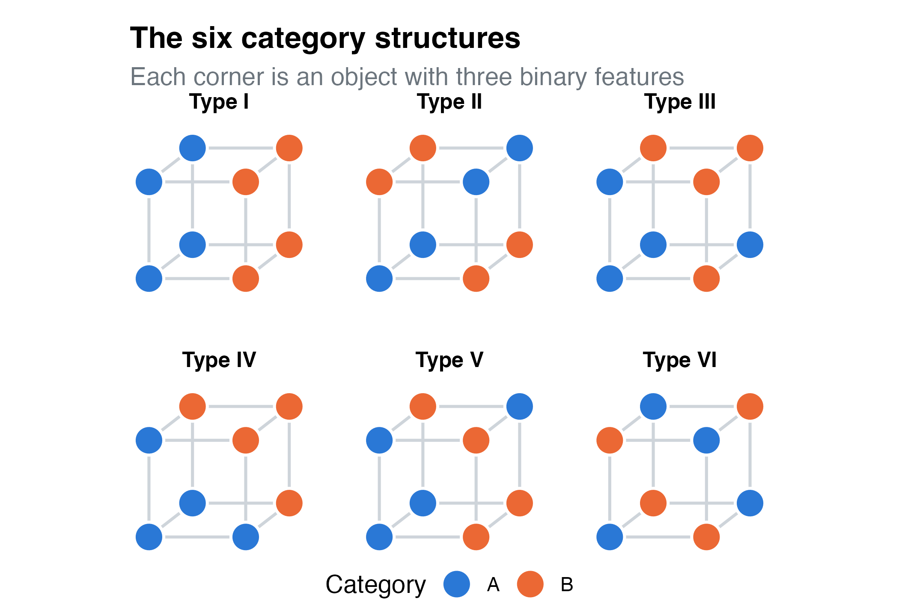

The [tutorial](tutorial.html) introduces parameter space partitioning on a small model. Each recipe applies it to a published model and analysis, and shows techniques that carry over to your own models.

```{=html}
<style>
.recipe-gallery { display: grid; grid-template-columns: repeat(auto-fill, minmax(18rem, 1fr)); gap: 1.25rem; margin: 1.5rem 0; }
.recipe-card { display: flex; flex-direction: column; border: 1px solid var(--bs-border-color); border-radius: var(--bs-border-radius);
               overflow: hidden; color: inherit; text-decoration: none; background: var(--bs-body-bg); transition: border-color 0.15s; }
.recipe-card:hover, .recipe-card:focus-visible { border-color: var(--bs-link-color); }
.recipe-card img { width: 100%; aspect-ratio: 16 / 10; object-fit: cover; border-bottom: 1px solid var(--bs-border-color); background: #fff; }
.recipe-card .recipe-body { padding: 0.9rem 1rem 1rem; display: grid; gap: 0.35rem; }
.recipe-card h3 { font-size: 1.1rem; margin: 0; color: var(--bs-link-color); }
.recipe-card p { margin: 0; font-size: 0.925rem; color: var(--bs-secondary-color); }
</style>
<div class="recipe-gallery">
  <a class="recipe-card" href="recipe-alcove.html">
    
    <div class="recipe-body">
      <h3>ALCOVE and the six category structures</h3>
      <p>A slow learning model with four parameters: patterns with ties, planning and saving a long run, reading a partition you cannot plot, and robustness checks.</p>
    </div>
  </a>
</div>
```
